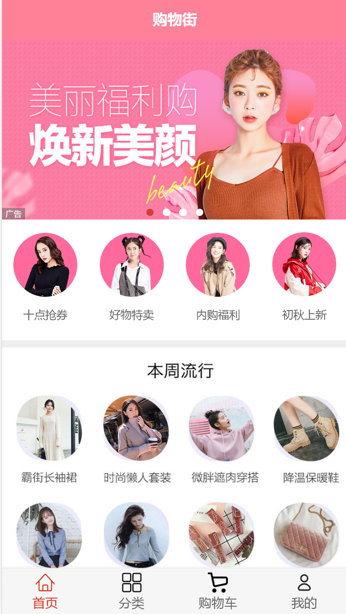
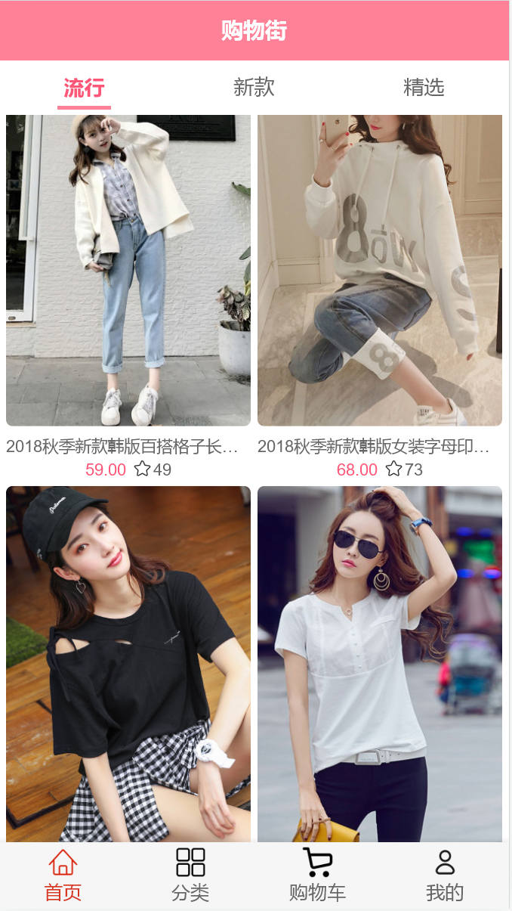
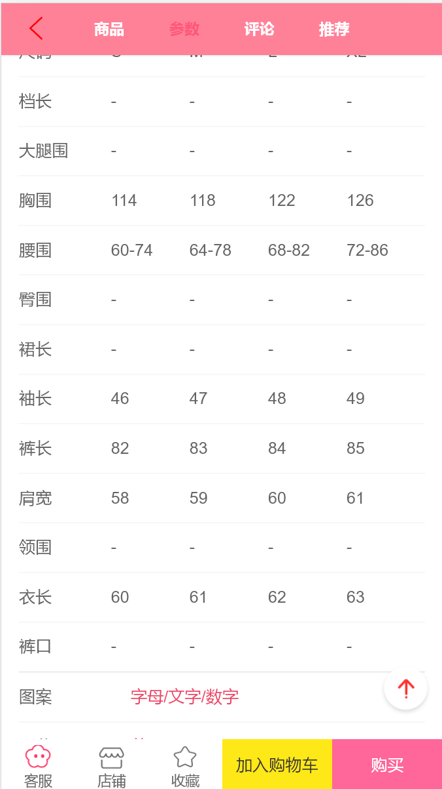
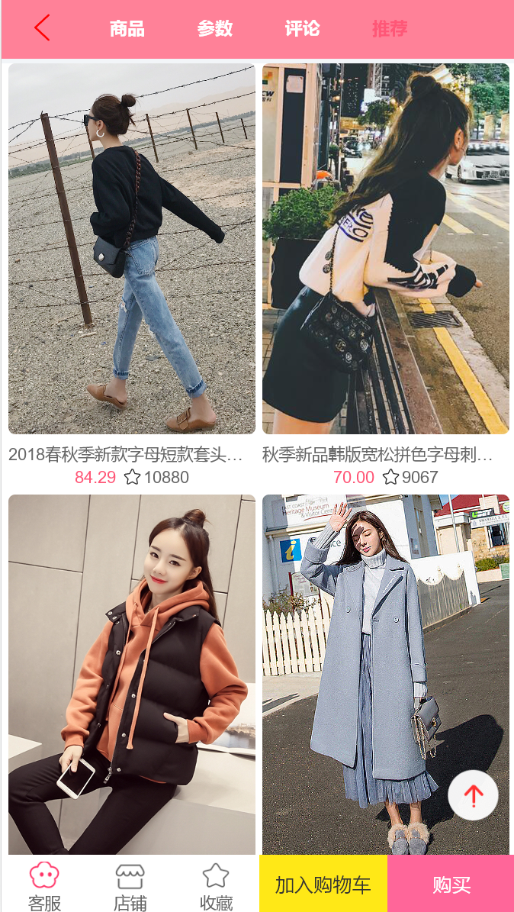
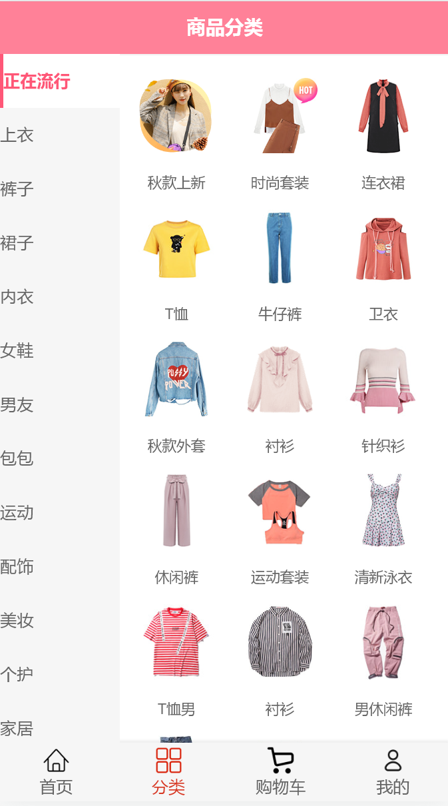
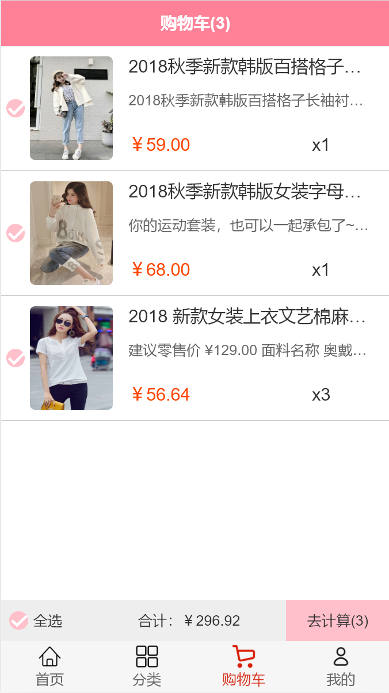
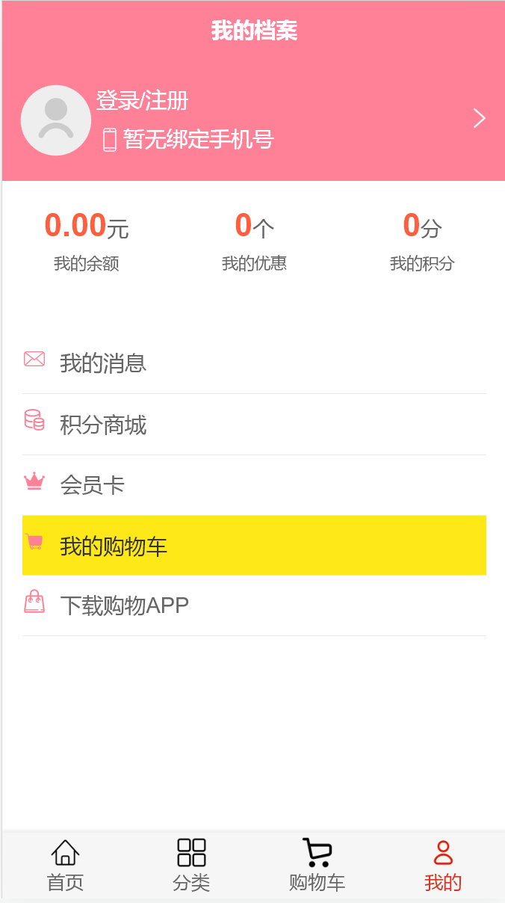

## Vue2商品购物app
### 项目简介
- 使用Vue2和Vant搭建的商品购物移动端项目
- 主要完成了商城首页，商品详情页，购物车，个人中心等模块
- 涉及到Vue-router,Vuex,fastclick,better-scroll等相关技术的使用

### 项目截图
#### 首页
> 顶部轮播图，分类，流行、新款、推荐商品展示

#### 商品详情页
> 商品信息，商品参数和相关推荐

#### 分类
> 商品信息分类展示

#### 购物车
> 加入购物车与结算（没做支付）

#### 我的
> 个人信息界面

